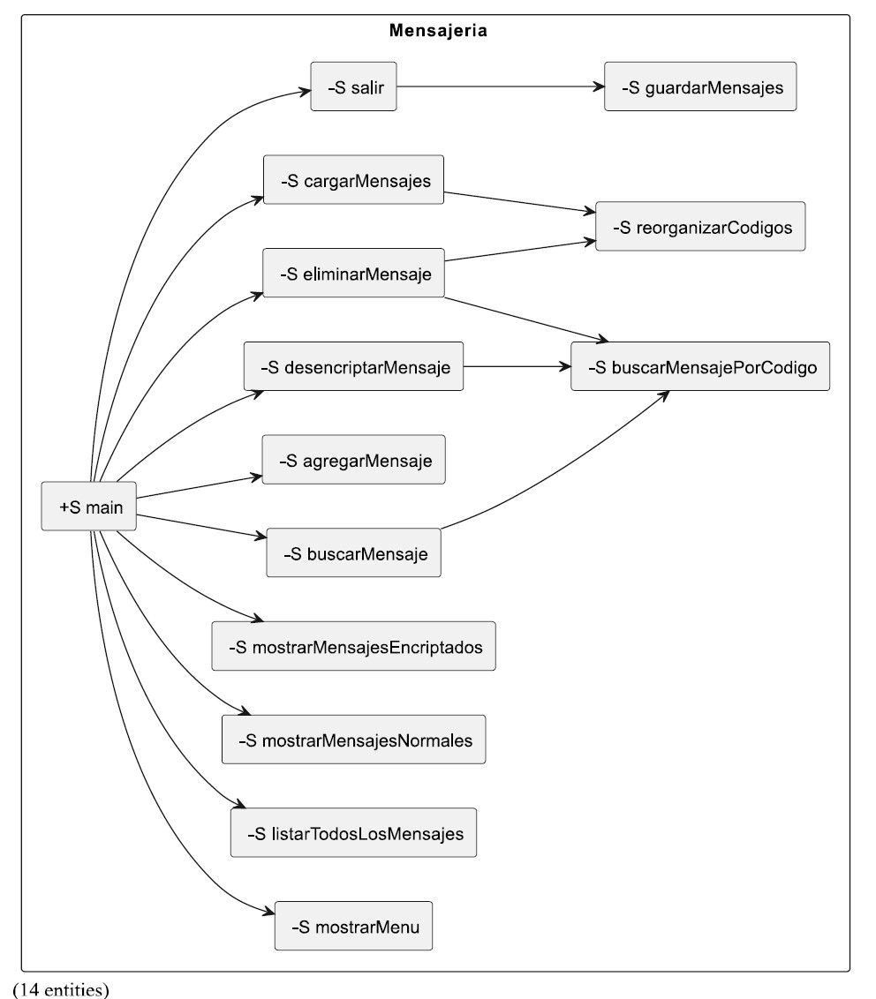

Enunciado

Se desea realizar un programa que sea capaz de gestionar el manejo de mensajes. Un mensaje está definido por un código numérico y un texto que es el mensaje en sí. Tendremos dos tipos de mensajes: mensajes sin encriptar y mensajes encriptados.
Mensajes sin encriptar: Los mensajes se almacenan tal y como los escribe el usuario.
Mensajes encriptados: Los mensajes se almacenan encriptados de forma que cada carácter se almacena sumándole uno a su código ASCII, es decir, cada uno de los caracteres que forman el mensaje será sustituido por el carácter resultante de sumarle uno al char (c = c+1 siendo c de tipo char). Los mensajes encriptados implementarán métodos para encriptar y desencriptar los mensajes y para ello, implementarán la interfaz IEncriptable que define los métodos encriptar y desencriptar.

Tendremos además una clase llamada Mensajería que tendrá el método main y, como atributo tendrá una lista de tamaño variable con todos los mensajes (encriptados y no encriptados).
Al iniciar el programa se mostrará un menú al usuario con las siguientes opciones:
- Listar todos los mensajes: muestra todos los mensajes de la lista. Esta opción nos dará la oportunidad de elegir si se quiere mostrar los mensajes por pantalla o guardarlos en un fichero de texto, cuyo nombre será pedido al usuario.
- Mostrar mensajes normales: muestra todos los mensajes no encriptados de la lista.
- Mostrar mensajes encriptados: se mostraran los mensajes encriptados sin desencriptar, tal y como están almacenados.
- Buscar mensaje: buscará un mensaje a partir de un código, si no existe se lo indicará al usuario.
- Añadir mensaje: preguntará al usuario que tipo de mensaje desea añadir (encriptado o normal) y lo añadirá a la lista.
- Desencriptar mensaje: mostrará un mensaje, desencriptándolo primero. Si el mensaje no existe o no está encriptado lo indicará por pantalla.
- Eliminar mensaje: eliminará un mensaje a partir de un código. Si no existe el mensaje lo indicará.
- Salir: sale de la aplicación.

Los mensajes deben tener como código la posición que ocupan dentro de la lista por lo que cada vez que eliminemos un mensaje deberemos reorganizar los códigos.
Cuando arrancamos el programa se comprobará si existe el fichero mensajes.dat que contiene los mensajes. Si existe, los carga en la lista.
Al salir del programa se guardará en el fichero mensajes.dat la lista de mensajes en formato binario.

